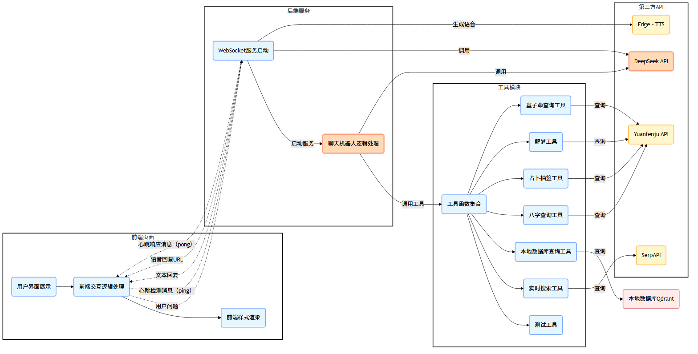

## 智能聊天助手项目

### 一、项目概述

本项目是一个智能聊天助手，模拟算命先生陈玉楼（陈大师）与用户进行交互。用户可通过网页前端输入问题，如八字查询、运势预测、解梦、占卜等，后端运用 LangChain 框架结合多个工具调用不同 API 进行解答，并使用 Edge - TTS 生成语音回复。

### 二、项目结构

```
testbot/
├── frontend/
│   ├── index.html          # 前端页面
│   ├── script.js           # 前端交互逻辑
│   └── style.css           # 前端样式
├── main.py                 # 主启动文件，包含 WebSocket 服务
├── server.py               # 后端服务，定义聊天机器人逻辑
└── Mytools.py              # 工具函数，包含多个查询工具
```

### 三、环境要求

```
Python 3.x
Node.js（可选，用于前端开发）
Redis 服务
```

### 四、安装依赖

后端依赖
在项目根目录下执行以下命令安装 Python 依赖：

```
pip install -r requirements.txt
```

前端依赖
前端部分主要使用 HTML、CSS 和 JavaScript，无需额外安装依赖。

### 五、配置文件

项目需要设置以下环境变量：

```
SERPAPI_API_KEY：SerpAPI 的 API 密钥，用于实时搜索。
DEEPSEEK_API_KEY：DeepSeek 的 API 密钥，用于调用大语言模型。
YUANFENJU_API_KEY：缘分居 API 的密钥，用于八字查询、童子命查询等。
```

### 六、运行项目

```
1. 启动 Redis 服务
   确保 Redis 服务已启动，并且配置文件中的 REDIS_URL 正确指向你的 Redis 实例。
2. 启动后端服务
   在项目根目录下执行以下命令启动后端服务：
   python main.py

默认情况下，服务将在 http://0.0.0.0:8000 上运行。

3. 打开前端页面
   在浏览器中打开 testbot/frontend/index.html 文件，即可开始与智能聊天助手进行交互。
```


### 七、功能介绍

```
1. 工具函数（Mytools.py）
   search(query)：用于实时搜索，调用 SerpAPI 进行查询。
   get_info_from_local_db(query)：用于查询本地知识库，当用户询问 2024 年运势或龙年运势相关问题时使用。
   bazi_cesuan(query)：八字查询工具，根据用户输入的姓名、性别、出生日期等信息查询八字。
   yaoyigua()：占卜抽签工具，调用缘分居 API 进行占卜。
   jiemeng(query)：解梦工具，根据用户输入的梦境内容进行解梦。
   tongziming(query)：童子命查询工具，根据用户输入的信息查询童子命相关信息。
2. 聊天机器人（server.py）
   聊天机器人模拟算命先生陈玉楼的角色，根据用户的问题选择合适的工具进行回答，并保存聊天记录。同时，支持根据用户的情绪调整回复的语气。
3. 前端交互（frontend）
   index.html：提供用户界面，包含聊天窗口和输入框。
   script.js：实现与后端的 WebSocket 通信，处理用户输入和服务器响应。
   style.css：定义页面的样式，使聊天界面美观易用。
```

### 八、注意事项

```
请确保你已经获得了所需的 API 密钥，并正确设置了环境变量。
项目中的模型路径和 Redis 连接信息需要根据实际情况进行修改。
前端页面中的头像图片使用了 https://picsum.photos 提供的随机图片，可能会受到网络限制。
```

### 九、贡献

```
如果你想为这个项目做出贡献，请遵循以下步骤：
Fork 本项目。
创建一个新的分支：git checkout -b feature/your - feature。
提交你的更改：git commit -m 'Add some feature'。
推送至远程分支：git push origin feature/your - feature。
提交 Pull Request。
```

